<div align="center">

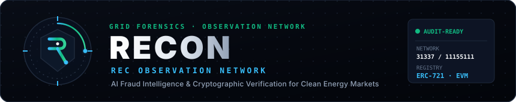

<a href="#-quick-start">
  
</a>

<br/>
<br/>

<p align="center">
  <a href="https://recon-navy-nu.vercel.app/"></a>
  <a href="https://fastapi.tiangolo.com"></a>
  <a href="https://nextjs.org"></a>
  <a href="https://ethereum.org"></a>
  <a href="https://scikit-learn.org"></a>
  <a href="https://networkx.org"></a>
</p>

<p align="center">
  <a href="backend/tests/"></a>
  <a href="backend/tests/"></a>
  <a href="contracts/contracts/RECRegistry.sol"></a>
  <a href="https://open-meteo.com/"></a>
  <a href="LICENSE"></a>
  <a href="https://github.com/prathamkariya/RECON-REC-Observation-Network/commits/main"></a>
</p>

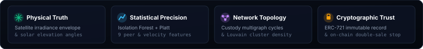

<p align="center">
  <a href="#-overview"><b>Overview</b></a> •
  <a href="#-the-trust-problem"><b>The Trust Problem</b></a> •
  <a href="#-observation-workflow"><b>Observation Workflow</b></a> •
  <a href="#-three-intelligence-witnesses"><b>Three Witnesses</b></a> •
  <a href="#-investigation-dossier"><b>Investigation</b></a> •
  <a href="#-blockchain-verification"><b>Blockchain</b></a> •
  <a href="#-system-architecture"><b>Architecture</b></a> •
  <a href="#-tech-stack-deep-dive"><b>Tech Stack</b></a> •
  <a href="#-quick-start"><b>Quick Start</b></a>
</p>

</div>

---

## 🛰️ Overview

> **RECON** (REC Observation Network) is an institutional fraud surveillance engine and forensic intelligence platform for Renewable Energy Certificate (REC) markets.

A Renewable Energy Certificate represents proof that 1 megawatt-hour (MWh) of green power was generated and fed into the power grid. Today's certification registries rely on delayed manual auditing and trust assumptions. Fraudulent issuances, impossible night solar generation, duplicate certificates, and wash-trading rings regularly slip through undetected.

RECON cross-examines every certificate claim from three independent perspectives—**atmospheric physics**, **statistical anomalies**, and **custody graph topology**—before a single token is minted. Clean claims receive cryptographic ERC-721 certificates on-chain; fraudulent claims produce an immutable forensic dossier for regulatory enforcement.

<br/>

### Comparison Matrix

| Capability | Legacy REC Registries | RECON Observation Network |
| :--- | :--- | :--- |
| **Verification Basis** | Unverified self-reported utility spreadsheets | **Tri-witness cross-examination (Physics + Stats + Graph)** |
| **Physics Verification** | None; trusted blindly | **Satellite solar elevation angles & clear-sky irradiance envelopes** |
| **Trading Surveillance** | Isolated counterparty records | **NetworkX multigraph cycle detection & Louvain cluster density** |
| **Detection Speed** | Months-delayed annual audit reconciliations | **Sub-second pre-flight scoring prior to on-chain minting** |
| **Explainability** | Opaque pass/fail or black-box manual review | **Ranked evidence hierarchy & plain-English forensic findings** |
| **Double-Sale Prevention**| Centralized database flag susceptible to race conditions | **On-chain `keccak256` unique generation key & permanent retirement locks** |

---

## ⚡ The Trust Problem

> **"Can you trust a clean energy certificate just because a database entry exists?"**

Existing certification ecosystems face four critical failure modes that distort sustainability reporting and green finance:

1. **Impossible Generation**: Solar facilities claiming power production at 02:00 AM local time, or output exceeding 100% of physical nameplate capacity.
2. **Duplicate Minting**: The identical megawatt-hour claimed across multiple regional registries or resold after retirement.
3. **Statistical Volumetric Cliffs**: Sudden generation surges (+6σ above regional peers) and artificial meter readouts that violate Benford’s law.
4. **Recirculating Trading Rings**: Colluding counterparties washing certificates in closed cycles to inflate clean energy trading volume.

<br/>

<div align="center">
  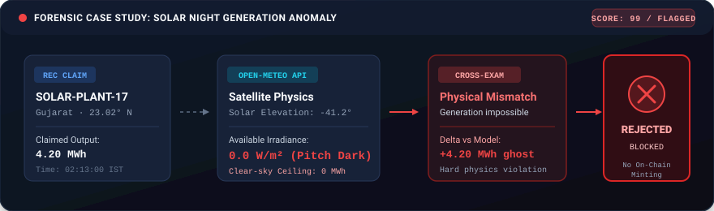
</div>

---

## 🔄 Observation Workflow

RECON operates on a strict principle: **No certificate enters circulation without passing multi-dimensional cross-examination.**

Claims pass through pre-flight analytical pipelines where atmospheric satellite models, unsupervised machine learning, and custody graph analytics evaluate risk simultaneously.

<br/>

<div align="center">
  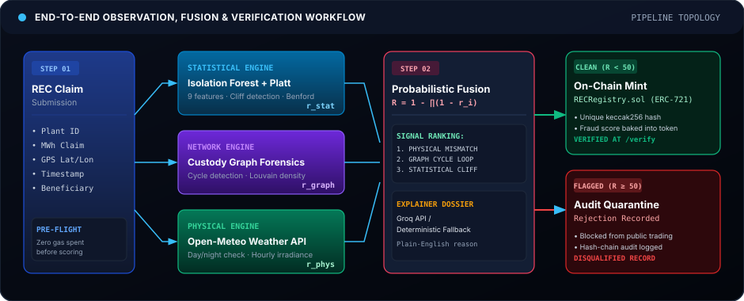
</div>

<br/>

### Surveillance in Action

When a high-risk claim enters the platform, the telemetry pulse triggers immediate multi-engine disqualification:

<div align="center">
  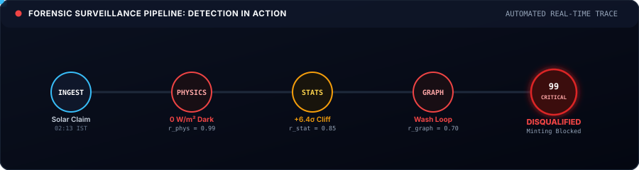
</div>

---

## 🧠 Three Intelligence Witnesses

A single fraud detector can be gamed. Three independent witnesses that share no common inputs cannot be fooled at once.

<br/>

<div align="center">
  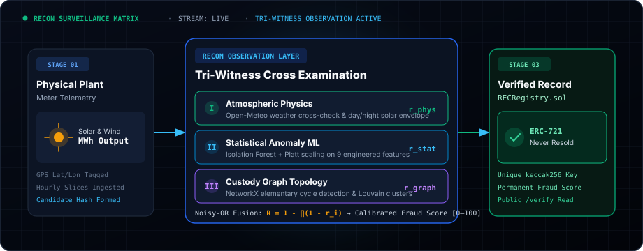
</div>

<br/>

### 1. Statistical Intelligence
*“Does this certificate behave abnormally compared to its historical and regional peers?”*

An Isolation Forest model calibrated via Platt scaling evaluates 9 engineered domain features. Volumetric cliffs, peer divergence, and leading-digit distributions drifting from Benford's law ($p < 0.05$) trigger calibrated probability scores ($r_{\text{stat}} \in [0, 1]$).

<div align="center">
  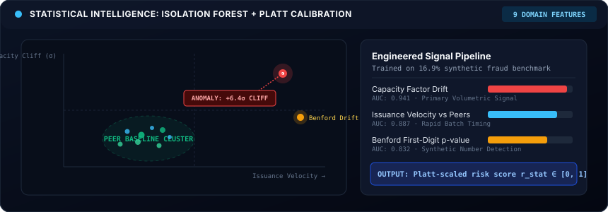
</div>

<br/>

### 2. Network Intelligence
*“Does trading behavior form a suspicious circular or wash-trading network?”*

RECON models certificate transfers across generators, aggregators, and buyers as a directed multigraph (`NetworkX MultiDiGraph`). It uncovers elementary cycles ($\text{length} \le 15$) where certificates loop back to issuer affiliates, alongside subgraphs exhibiting transfer densities $> 3.0\times$ the market baseline.

<div align="center">
  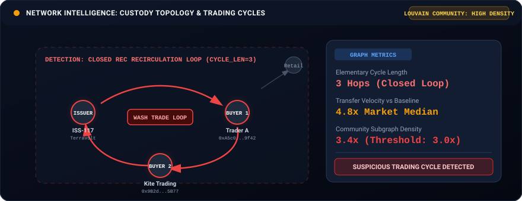
</div>

<br/>

### 3. Physical Validation
*“Could this generation physically have occurred at the plant's GPS coordinates?”*

Generation claims are cross-examined against high-resolution satellite atmospheric data from Open-Meteo at the plant’s exact latitude and longitude. Solar elevation angles below the horizon ($0.0\text{ W/m}^2$ available irradiance) trigger immediate physical disqualification.

<div align="center">
  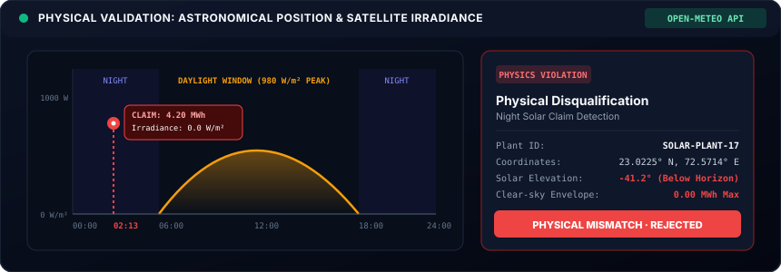
</div>

<br/>

### Probabilistic Risk Fusion

The three engine scores are synthesized into a composite fraud probability ($R \in [0, 100]$) using **Noisy-OR probabilistic fusion**:

$$R = 100 \times \left( 1 - \prod_{i \in \{\text{phys}, \text{stat}, \text{graph}\}} (1 - r_i) \right)$$

* Claims with $R < 50$ are certified as clean and approved for on-chain ERC-721 minting.
* Claims with $R \ge 50$ are quarantined, logged to the tamper-evident hash-chain audit ledger, and barred from tokenization.

---

## 📋 Investigation Dossier

> **Detection tells you WHAT is suspicious. Evidence tells you WHY.**

RECON replaces opaque risk numbers with deterministic evidence dossiers. Every flagged certificate surfaces the exact physical laws violated, peer standard deviations crossed, and counterparty entities involved.

<br/>

<div align="center">
  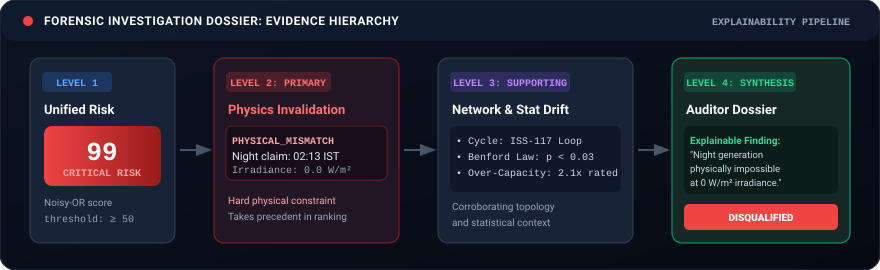
</div>

<br/>

Each investigation record contains:
* **Composite Risk Score (0–100)**: Probability outcome synthesized across all three observation engines.
* **Primary Evidence (Smoking Gun)**: The highest-ranking determining factor (e.g., night solar generation at $0\text{ W/m}^2$).
* **Supporting Corroboration**: Secondary anomalies including trading velocity spikes, peer capacity cliffs, and Benford drift.
* **Synthesized Finding**: Plain-English narrative generated via Claude 3.5 Sonnet (with deterministic rule-based fallback).
* **Cryptographic Verification Proof**: On-chain token ID, transaction hash, and immutable generation record key.

---

## 🎯 Explainability Pipeline

Regulatory enforcement demands defensible findings. RECON ranks signals through an immutable precedence hierarchy:

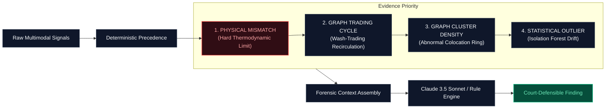

---

## 🔒 Blockchain Verification

> **AI detects. Blockchain preserves. Anyone can verify.**

Blockchains cannot determine whether an energy generation claim was physically honest. Writing unverified data to a blockchain merely immortalizes fraud.

RECON uses AI off-chain to detect fraud *before* minting. Once validated, the smart contract (`RECRegistry.sol`) guarantees mathematical uniqueness, prevents double-spending, and provides public auditability.

<br/>

<div align="center">
  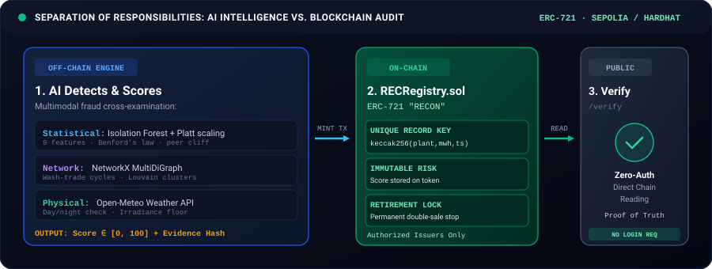
</div>

<br/>

### Smart Contract Guarantees (`RECRegistry.sol`)
* **Unique Generation Key**: Prevents double-certification by enforcing a cryptographic fingerprint:
  $$\text{RecordKey} = \text{keccak256}(\text{plantId}, \text{energyMWh}, \text{generationTimestamp})$$
  Submitting the same generation slice twice reverts on-chain with `DuplicateGeneration()`.
* **On-Chain Risk Scores**: The fraud score (0–100) is permanently written to the ERC-721 token metadata. Downstream green markets can programmatically reject high-risk certificates.
* **Retirement Protection**: Calling `retire()` permanently locks the token, blocking subsequent transfers or duplicate redemption.
* **Zero-Auth Public Verification**: Any market participant can query the smart contract or access `/verify` to inspect on-chain state without an account or API key.

---

## 🏗️ System Architecture

RECON pairs a modern Next.js 16 frontend with high-performance Python analytical microservices, in-process Hardhat EVM testing, and live Ethereum Sepolia deployment.

<br/>

<div align="center">
  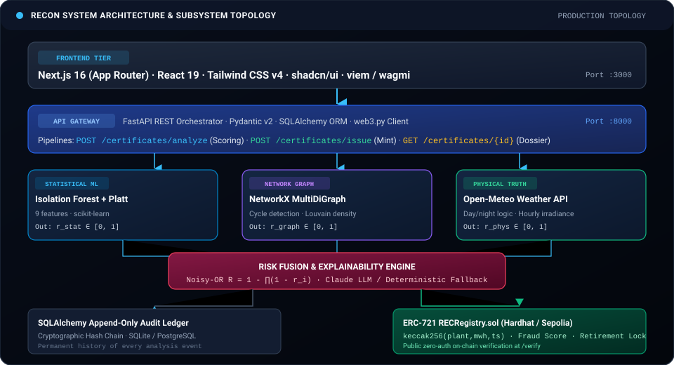
</div>

<br/>

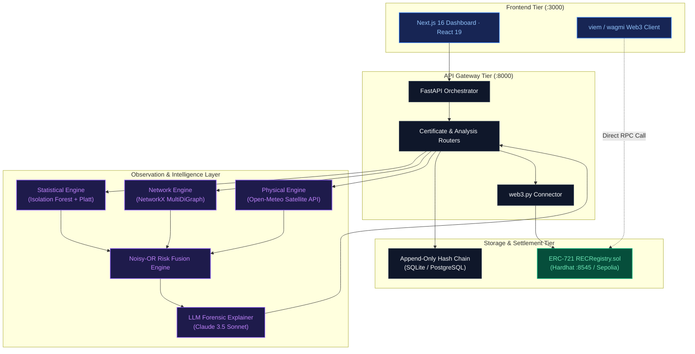

---

## 💻 Tech Stack Deep Dive

RECON's architecture is organized into five specialized engineering tiers, balancing high-speed statistical computing, deterministic blockchain guarantees, and real-time visual surveillance.

<br/>

<div align="center">
  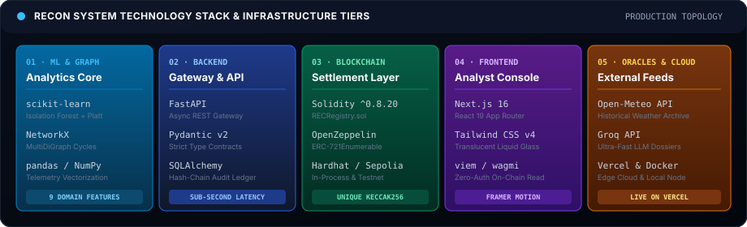
</div>

<br/>

### 1. Machine Learning & Scientific Computing
<p>
  
  
  
  
  
</p>

* **`scikit-learn` (Isolation Forest + Platt Scaling)**: Unsupervised anomaly detection isolating out-of-distribution volumetric claims. Raw tree isolation depths are calibrated via sigmoid logistic regression (Platt scaling) to yield probabilistic risk values $r_{\text{stat}} \in [0, 1]$.
* **`NetworkX` (MultiDiGraph)**: Directed multigraph representation of market participants. Implements Johnson's elementary cycle algorithm ($\text{length} \le 15$) to detect circular wash-trading loops, and Louvain modularity to flag high-density collusive clusters ($> 3.0\times$ market baseline).
* **`pandas` & `NumPy`**: Vectorized domain feature engineering (9 features including capacity factor z-scores, issuance velocity derivatives, and Benford first-digit Kolmogorov-Smirnov p-values).

### 2. Backend Orchestration & Microservices
<p>
  
  
  
  
  
</p>

* **`FastAPI`**: High-performance asynchronous REST gateway serving sub-second inference pipelines (`/certificates/analyze` for pre-flight scoring, `/certificates/issue` for on-chain minting).
* **`Pydantic v2`**: Strict runtime schema enforcement ensuring certificate payloads conform to telemetry standards before reaching models.
* **`SQLAlchemy`**: Manages the append-only audit trail and local persistence with cryptographic hash chaining (`prev_hash` $\rightarrow$ `current_hash`).
* **`Web3.py`**: Interacts with local Hardhat EVM nodes and Ethereum Sepolia contracts, packaging and dispatching minting transactions with dynamic gas estimation.

### 3. Smart Contracts & Trust Layer
<p>
  
  
  
  
</p>

* **`Solidity ^0.8.20` (`RECRegistry.sol`)**: ERC-721 standard implementation extended with an on-chain mapping `recordKeyUsed[bytes32]`. Enforces generation uniqueness:
  $$\text{Key} = \text{keccak256}(\text{abi.encodePacked}(\text{plantId}, \text{energyMWh}, \text{generationTimestamp}))$$
* **`OpenZeppelin Contracts`**: Production-grade `ERC721Enumerable` and `Ownable` primitives ensuring standardized compliance and verified access control.
* **`Hardhat`**: Automated compilation, deployment scripting, and fast in-process EVM test execution.

### 4. Analyst Console & Frontend
<p>
  
  
  
  
  
</p>

* **`Next.js 16` & `React 19`**: App router architecture leveraging React Server Components for initial load speed and reactive client components for interactive surveillance.
* **`Tailwind CSS v4`**: Custom Stitch "Fidelity Technical Editorial" theme utilizing translucent liquid glass panels, obsidian backgrounds, and calibrated signal indicators.
* **`viem` / `wagmi`**: Lightweight Web3 hooks enabling instant, zero-auth public reading of on-chain certificate state directly from RPC providers.

### 5. Oracles, AI Explainability & Infrastructure
<p>
  
  
  
  
</p>

* **`Open-Meteo REST API`**: Solar radiation and astronomical models delivering historical clear-sky DNI (Direct Normal Irradiance) and sun position at high geospatial resolution.
* **`Claude 3.5 Sonnet`**: Synthesizes multi-engine anomalies into concise, court-defensible plain-English dossiers, backed by a deterministic rule-based fallback.
* **`Docker Compose`**: Multi-container declarative orchestration packaging Next.js, FastAPI, and local Hardhat into a unified local environment.

---

## 🚀 Quick Start

Launch the complete RECON platform locally with one command:

```bash
# 1. Clone repository
git clone https://github.com/prathamkariya/RECON-REC-Observation-Network.git
cd RECON-REC-Observation-Network

# 2. Start full stack (Frontend, Backend, and Hardhat EVM node)
docker compose up --build
```

### Access Endpoints

| Service | Address | Role |
| :--- | :--- | :--- |
| **Surveillance Dashboard** | `http://localhost:3000` | Full operator console, registry, and analysis views |
| **API Documentation** | `http://localhost:8000/docs` | Interactive Swagger API explorer and schema contracts |
| **Hardhat EVM Node** | `http://localhost:8545` | Local in-process Ethereum test environment |

---

## 📊 Verified Metrics

All statistics are verified directly against repository test suites and benchmark data:

<div align="center">

| Metric | Verified Value | Benchmark Reference |
| :---: | :---: | :--- |
| **Automated Tests** | **176+ Passing** | 13 pytest suites + 17 Hardhat tests covering backend, ML, graph, weather, and Web3 |
| **Test Coverage** | **High** | Comprehensive coverage across core services and smart contracts |
| **Detection Witnesses** | **3 Independent** | Atmospheric physics, isolation statistics, custody graph |
| **Decision Threshold** | **0.50 (50 / 100)** | Calibrated noisy-OR cut point for high-risk flags |
| **Duplicate Prevention** | **100% Guaranteed** | Reverts on-chain via unique `keccak256` generation hash |

</div>

---

<details>
<summary><b>Technical Implementation &amp; Deep Dive</b></summary>

<br/>

### Five Mock-or-Real Adapters
RECON backend services are designed for zero-config local development with instant opt-in to live production integrations via environment variables in `backend/.env`:

* `USE_REAL_ML` (default: `false`): When `true`, executes the trained `IsolationForest` model (`ml/model.joblib`) with Platt scaling. When `false`, uses the calibrated statistical mock.
* `USE_REAL_GRAPH` (default: `false`): When `true`, runs cycle detection and Louvain community analysis against the full NetworkX market graph. When `false`, uses the deterministic graph mock.
* `USE_REAL_WEATHER` (default: `false`): When `true`, queries live satellite weather and clear-sky solar models via Open-Meteo REST API. When `false`, uses the physical calculation mock.
* `USE_REAL_EXPLAIN` (default: `false`): When `true`, calls Anthropic Claude 3.5 Sonnet to synthesize plain-English findings. When `false`, uses the deterministic rule-based ranking engine.
* `USE_REAL_LEDGER` (default: `false`): When `true`, writes every analysis event to PostgreSQL. When `false`, records to local SQLite.

### Running Test Suites
```bash
# Run backend pytest suite (176+ tests)
cd backend
pytest -v

# Run smart contract Hardhat tests
cd contracts
npx hardhat test
```

### Repository Structure
```
RECON-REC-Observation-Network/
├── backend/                  # FastAPI orchestration server
│   ├── app/
│   │   ├── routers/          # /certificates, /recs, /status
│   │   ├── service.py        # Noisy-OR fusion & pipeline orchestration
│   │   ├── config.py         # 5 adapter flags & environment configuration
│   │   └── web3_client.py    # Hardhat / Sepolia smart contract connector
│   └── tests/                # 13 comprehensive pytest test suites
├── contracts/                # Solidity smart contract suite
│   ├── contracts/            # RECRegistry.sol (ERC-721 + unique record key)
│   ├── scripts/              # Deployment and seed minting scripts
│   └── test/                 # Hardhat unit tests
├── dashboard/                # Next.js 16 / React 19 surveillance console
│   ├── app/                  # App router pages (dashboard, verify, issue, etc.)
│   ├── components/           # UI components, control room charts, glass panels
│   └── lib/                  # Web3 configuration (viem/wagmi) and API client
├── graph_explain/            # Graph analytics and explainability modules
│   ├── graph/                # NetworkX cycle detection & Louvain clustering
│   ├── weather/              # Open-Meteo API satellite integration
│   └── llm/                  # Claude explainer & deterministic rule fallback
├── ml/                       # Machine learning pipeline
│   ├── model.py              # Isolation Forest + Platt scaling calibration
│   └── feature_engineering.py# 9 engineered domain features
├── ledger_cloud/             # Append-only hash chain audit ledger
└── docs/assets/              # Architectural diagrams and branding assets
```

</details>

---

<div align="center">

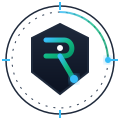

<br/>

**RECON — REC OBSERVATION NETWORK**  
*AI Fraud Intelligence &amp; Cryptographic Verification for Clean Energy Markets*

[Return to Top ↑](#recon)

</div>
